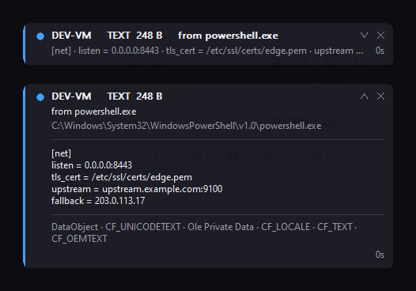

# WhoseClip

If you work across a host and a few VMware guests, you've probably pasted the
wrong thing at least once. VMware hands the clipboard between host and guest
whenever a window takes focus. So what you copied a minute ago on one machine is
often not what's sitting on the clipboard of the machine you just clicked into.

That's the whole problem this solves. WhoseClip sits in the corner of each
machine and tells you what's on *that* machine's clipboard, and which process put
it there.



Run one copy per machine. The accent colour means the same thing everywhere and
tells you where the content came from: blue for copied on this machine, orange
for arrived from another one, grey for nothing there.

It's not a clipboard manager. There's no history, and no clipboard content is
ever saved.

---

## Get it

Both builds sit in the **[`release/`](release/)** folder:

1. Open **[`release/whoseclip-x64.exe`](release/whoseclip-x64.exe)**,
   or [`release/whoseclip-x86.exe`](release/whoseclip-x86.exe)
   if you have 32-bit guests.
2. Click the **Download raw file** button, the download icon at the top right of
   the file view. GitHub shows a preview page for binaries rather than
   downloading them, but the button still works.
3. Run it. That's the whole setup.

One file. No installer, no runtime, nothing to register, and it works on Windows
Vista or later.

The exe is unsigned, so SmartScreen will probably warn you the first time. Build
it yourself if you would rather not take my word for it.

Labels, colours and where the strip sits are all optional, and live in
[Options](#options) or in `whoseclip.ini` next to the exe.

## Using it

The tray icon carries the accent colour and the first letter of the label, so
you can read the state without opening anything.

| Action | What it does |
| --- | --- |
| Hover the tray icon | the whole readout, as a tooltip |
| Left-click the tray icon | show or hide the strip |
| Right-click the icon or the strip | menu: expand, pause, list formats, copy diagnostics, exit |
| Chevron, or double-click the strip | expand or collapse |
| The x | hide the strip; the tray icon stays behind |
| Drag anywhere else on the strip | move it, and it remembers where |

Collapsed is the glance: which machine, what kind of thing, which process, a
one-line preview, how long ago.

Expanded is for reading. Full origin, full path of the owning process, the whole
preview with its line breaks intact, every file in a multi-file copy with its own
size, and the clipboard formats. Nothing is cut off.

## Copying files out of a VM

A file copied from a guest doesn't exist on the host yet, so Windows can't give
you a path for it. You get a descriptor instead: names and sizes, with the bytes
streamed across only when you paste.

WhoseClip reads that descriptor, so a file dragged out of a VM shows up as:

```
DEV-VM   FILES (1) virtual   4.6 MB   via vmtoolsd.exe
payload_x64.exe
```

That word `virtual` is the giveaway that nothing has actually crossed yet.
Expand the strip to see every file in the set with its own size.

If a file copy ever shows up as `OTHER` with a `DataObject` format, expand the
strip and look at the format list along the bottom. It means the source is using
a shape WhoseClip doesn't handle yet.

## Turning off VMware clipboard sharing

Worth knowing even if you keep it on: everything you copy on the host lands in
the clipboard of whichever VM you click into next. If you'd rather it didn't, use
**VM Settings > Options > Guest Isolation**, or add this to the `.vmx`:

```
isolation.tools.copy.disable = "TRUE"
isolation.tools.paste.disable = "TRUE"
```

---

## Reference

### Options

| Argument | ini key | Meaning |
| --- | --- | --- |
| `--label NAME` | `label` | Machine name shown in the UI. Defaults to the computer name. |
| `--color-local RRGGBB` | `colorLocal` | Accent for content copied on this machine |
| `--color-foreign RRGGBB` | `colorForeign` | Accent for content that came from elsewhere |
| `--strip` / `--no-strip` | `showStrip` | Show the strip at startup |
| `--expanded` / `--collapsed` | `expanded` | Start with the strip expanded |
| `--preview N` | `previewChars` | Characters of preview to keep. Default 1500, max 4088. |

The ini takes a few more that have no argument: `colorIdle` for an empty or
paused clipboard, `colorBg`, `colorFg` and `colorDim` for the strip itself,
`stripX` and `stripY` for its position, and `extraExternals` if you want to add
your own relay process names.

The colour options are there for taste and for eyesight, not for telling
machines apart. Set them the same on every machine or the accent stops meaning
anything. Blue against orange is the default because it survives the common
forms of colour blindness, which red against green does not.

### What it reads

| Signal | Where it comes from |
| --- | --- |
| Owning process | `GetClipboardOwner`, then `QueryFullProcessImageNameW` |
| Came from another machine | the owner is a known relay: `vmtoolsd.exe`, `vmware-vmx.exe`, `rdpclip.exe`, `VBoxTray.exe` and a few others |
| Originating web page | the `SourceURL:` header inside `CF_HTML` |
| Kind and size | `CF_UNICODETEXT`, `CF_HDROP`, `CF_DIB`, registered formats |
| Virtual file names and sizes | `FileGroupDescriptorW` |
| Copy or move | `Preferred DropEffect` |
| Source asked not to be monitored | `ExcludeClipboardContentFromMonitorProcessing`, `CanIncludeInClipboardHistory`, `CanUploadToCloudClipboard`. Reported in the diagnostics dump, never acted on. |
| Who is blocking the clipboard | `GetOpenClipboardWindow`, when `OpenClipboard` fails |

Windows doesn't record where clipboard content came from, so "came from another
machine" is inferred from that relay list rather than read from anywhere.
`SourceURL` is the only origin the OS genuinely carries.

### What it doesn't do

Clipboard content never touches disk. The only file it writes is
`whoseclip.ini`, which holds the strip position, visibility and expanded state.

There's no network code in the binary at all, which you can check yourself:
`dumpbin /imports release\whoseclip-x64.exe` lists four system DLLs and nothing
else.

Reads are bounded to `previewChars` characters. Anything larger gets measured
rather than read, and the preview buffer is wiped before reuse and on exit.

It also won't hold the clipboard open for longer than it takes to read that
preview, and capture waits 120 ms after a change so it doesn't collide with
whatever application is still writing.

### Building it yourself

You need Visual Studio 2022, or just the Build Tools, with the Windows SDK.

```
build.cmd         both architectures
build.cmd x64     64-bit only
build.cmd x86     32-bit only
```

Output lands in `build\x64\whoseclip.exe` and `build\x86\whoseclip.exe`.

### Testing

The scripts in `tools\` put synthetic payloads on the clipboard and screenshot
the strip after each one, so you can exercise the display paths without needing a
password manager, a browser, or a VM.

| Script | What it covers |
| --- | --- |
| `cliptest.ps1` | empty clipboard, text, text marked not-for-monitoring, browser HTML with a SourceURL, file drops, images |
| `cliptest_strip.ps1` | collapsed and expanded layouts, with multi-line text |
| `cliptest_expand.ps1` | multi-file drops, real and virtual, in both layouts |
| `cliptest_close.ps1` | clicks the close button and checks the state persisted |

## License

MIT. See [LICENSE](LICENSE). Written by u2601.
